# Ansible Refactoring & Static Assignments (Imports & Roles)

Refactoring is a general term in computer programming. It means making changes to the source code without changing expected behaviour of the software. The main idea of refactoring is to enhance code readability, increase maintainability and extensibility, reduce complexity, add proper comments without affecting the logic.


# Step 1 - Jenkins Job Enhancement

To save space and simplify running commands, a new Jenkins project/job is being introduced to avoid creating a separate directory for every code change.

# Project Architecture 
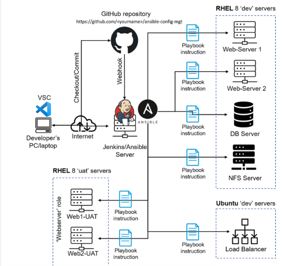

1. Go to your Jenkins-Ansible server and create a new directory called ```ansible-config-artifact``` – we will store there all artifacts after each build

```bash
sudo mkdir /home/ubuntu/ansible-config-artifact
```
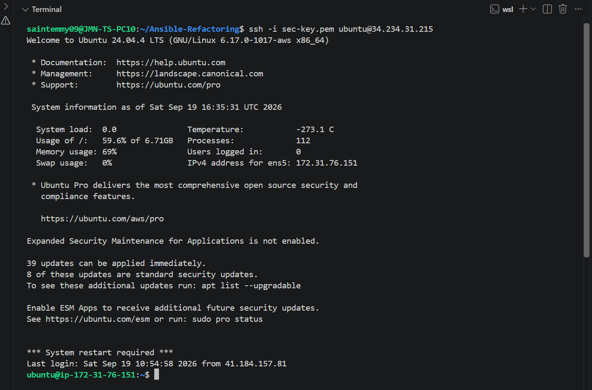

2. Change permissions to the directory sp jenkins can save files there 
```bash 
sudo chmod -R 0777 /home/ubuntu/ansible-config-artifact
```
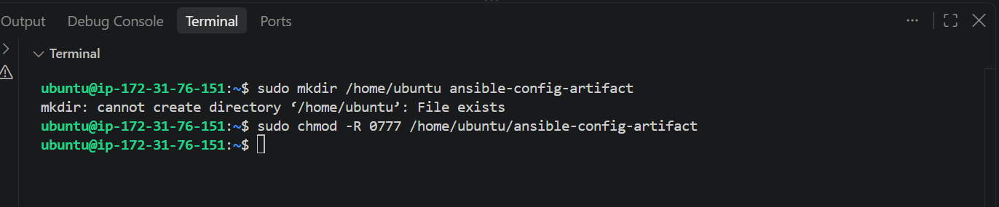

3. Go to Jenkins web console -> Manage Jenkins -> Manage Plugins -> on Available tab search for ```Copy Artifact``` and install this plugin without restarting Jenkins. 

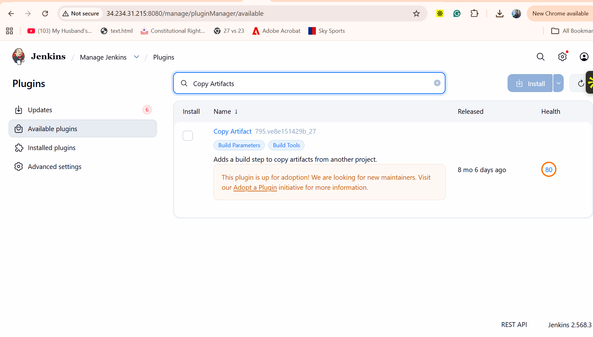
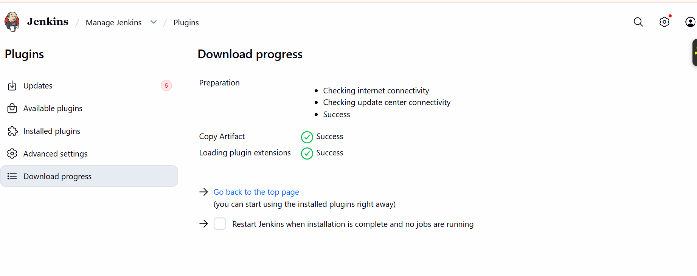

4. Create a new Freestyle project and name it ```save_artifacts```
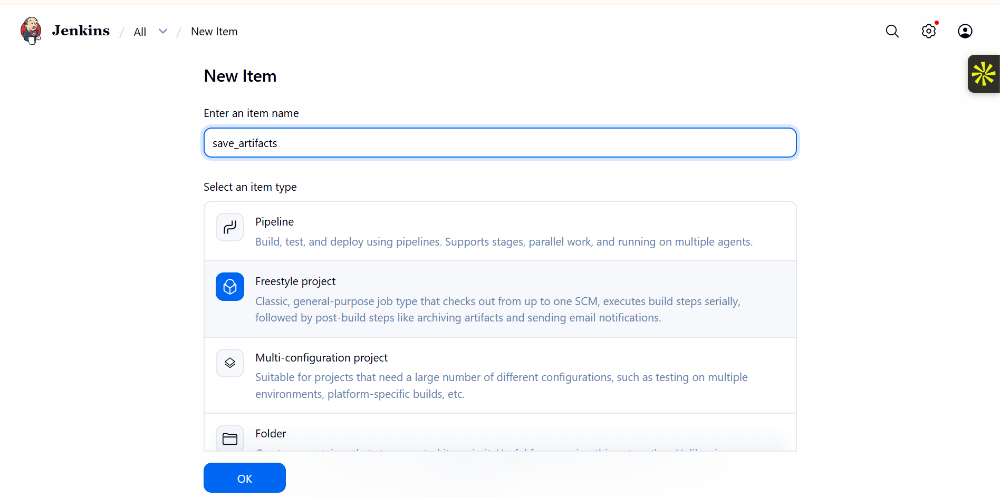

5. This project will be triggered by completion of your existing ansible project. Configure it accordingly.

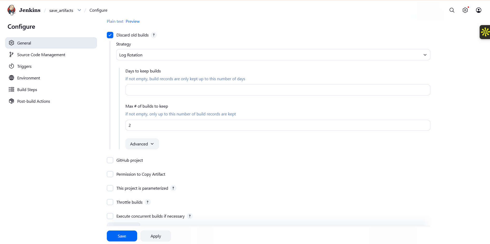
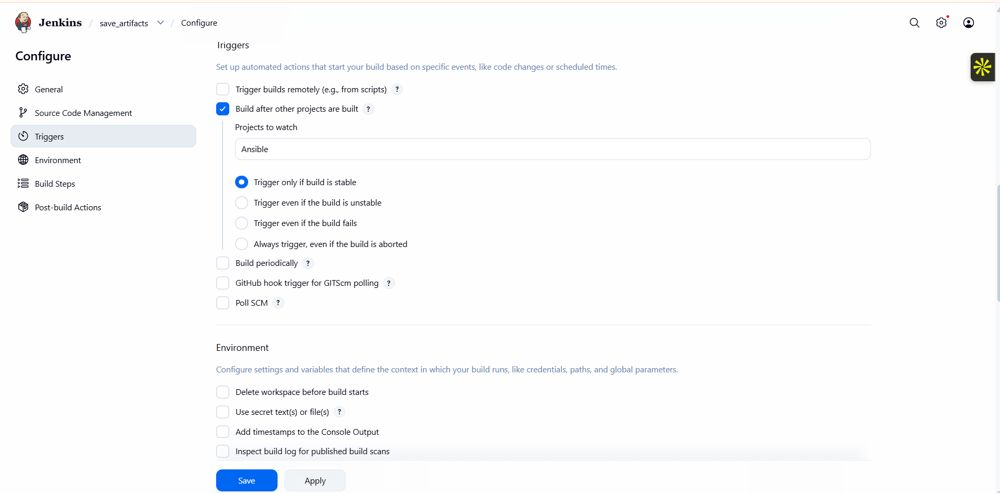

6. The main idea of save_artifacts project is to save artifacts into /home/ubuntu/ansible-config-artifact directory. To achieve this, create a Build step and choose Copy artifacts from other project, specify ansible as a source project and /home/ubuntu/ansible-config-artifact as a target directory. 
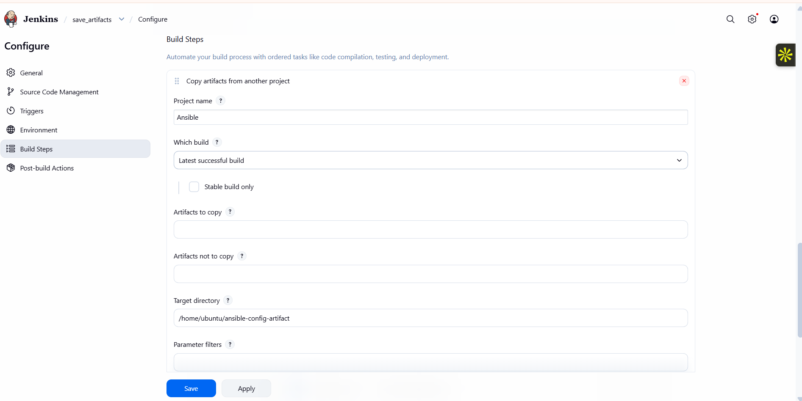

7. Test the set up by making some change in README.MD file inside your ansible-config-mgt repository. 

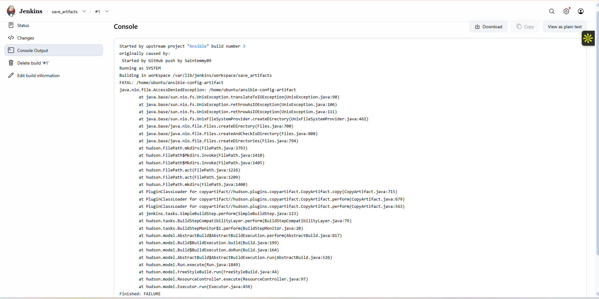

## Issue: save_artifacts Jenkins job failed with AccessDeniedException

**Error/Cause:** Build failed with `java.nio.file.AccessDeniedException: /home/ubuntu/ansible-config-artifact`. The target directory itself had correct permissions (`drwxrwxrwx`), but its parent `/home/ubuntu` was `drwxr-x---`, blocking Jenkins' own user from even traversing into it to reach the folder.

**Fix:**
```bash
sudo chmod o+x /home/ubuntu
```

Confirmed fixed — `save_artifacts` build succeeded on the next trigger.

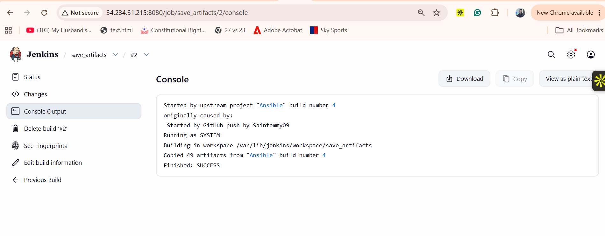
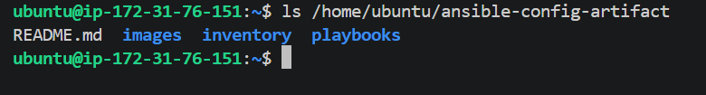

Step 2 – Refactor Ansible code by importing other playbooks into ```site.yml```

Before refactoring, pull the latest code from the master branch and create a new refactor branch.

Refactoring is about continuously improving code for better organization, efficiency, and maintainability. While common.yml currently contains all tasks in one file, this approach can become difficult to manage as the number of tasks and supported OS/server types increases.

A better approach is to break tasks into separate files and organize them properly. This makes the Ansible code easier to understand, maintain, reuse, and apply to different servers or OS families.

1. Within playbooks folder, create a new file and name it site.yml — This file will now be considered as an entry point into the entire infrastructure configuration. Other playbooks will be included here as a reference. In other words, site.yml will become a parent to all other playbooks that will be developed. Including common.yml that was created previously. 

```bash
touch site.yml
```
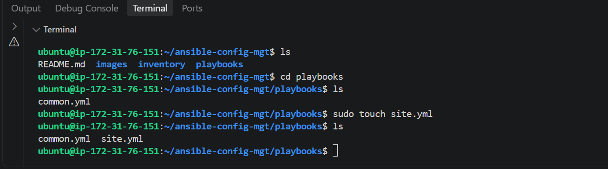

2. Create a new folder in root of the repository and name it ```static-assignments```. The static-assignments folder is where all other children playbooks will be stored. This is merely for easy organization of your work.

```bash
sudo mkdir static-assignments
```
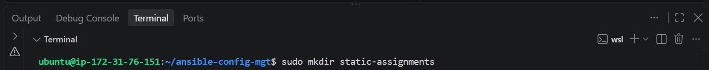

3. Move common.yml file into the newly created static-assignments folder.

```bash
sudo mv playbooks/common.yml static-assignments/common.yml
```
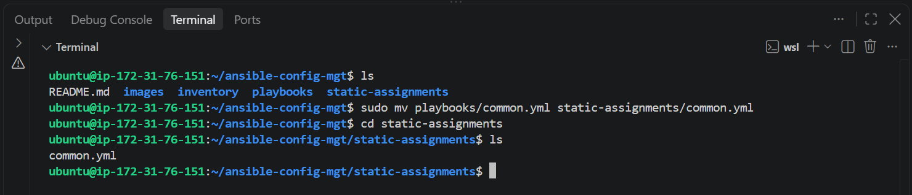

4. Inside ```site.yml``` file, import ```common.yml``` playbook.
```bash
---
- hosts: all
- import_playbook: ../static-assignments/common.yml
```
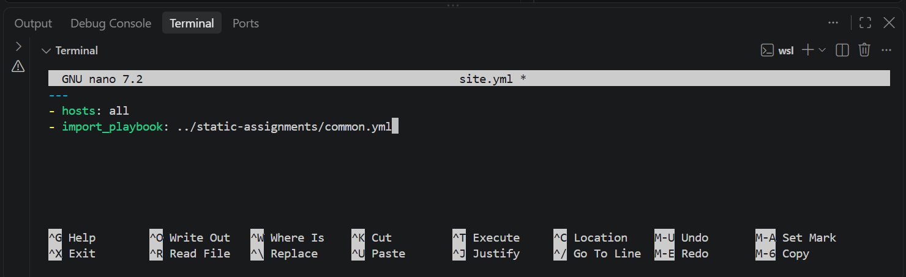

5. Create another playbook under static-assignments and name it common-del.yml

```bash
nano common-del.yml
```
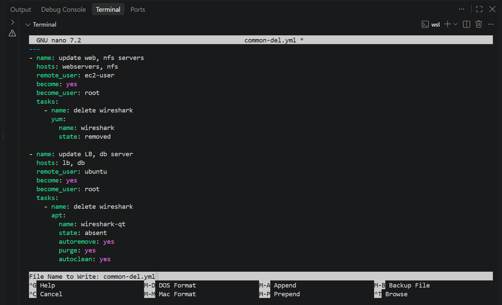

update site.yml with - import_playbook: ../static-assignments/common-del.yml instead of common.yml and run it against dev servers

```bash
nano playbooks/site.yml
```
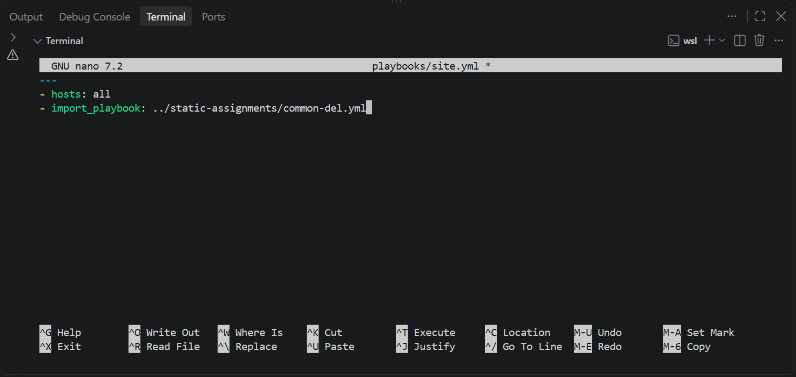
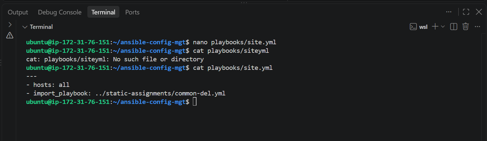

6. Run the list-tasks

```bash
ansible-playbook -i inventory/dev.yml playbooks/site.yml
```
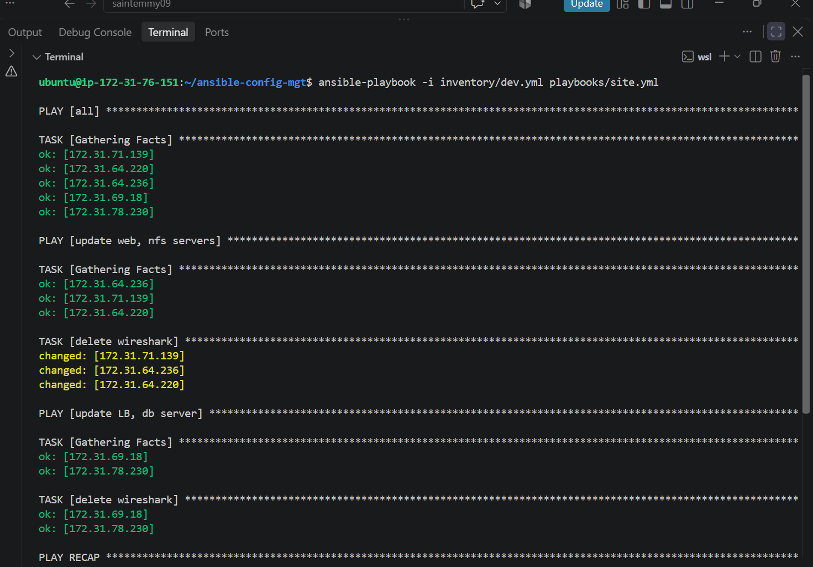
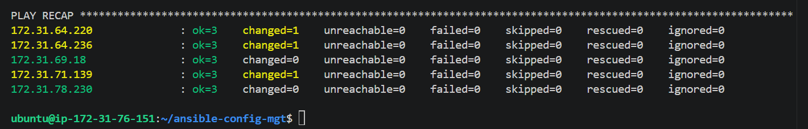

7. Verify wireshark is deleted 

```bash
wireshark --version
```
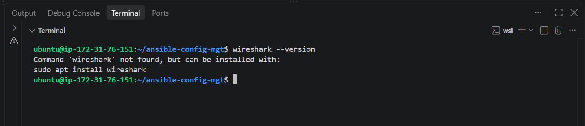

# Step 3 - Configure UAT Webservers with a role 'Webserver'

1. Launch 2 fresh EC2 instances using RHEL 8 image, we will use them as our uat servers, so give them names accordingly – ```Web1-UAT and Web2-UAT```

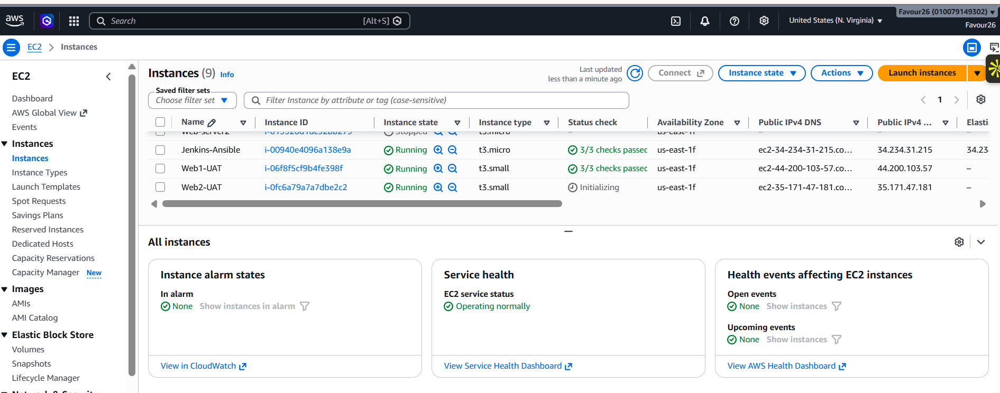

2. Create the roles directory structure

From ansible-config-mgt repo root:

```bash
mkdir roles
cd roles
ansible-galaxy init webserver
```
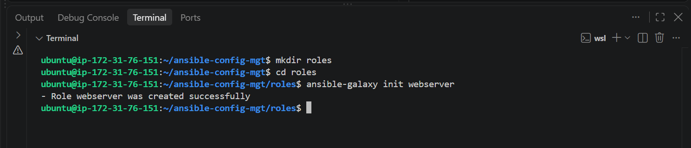

 Confirm the directory structure 
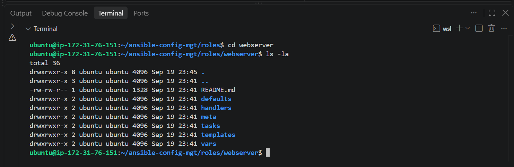

3. Update the inventory ansible-config-mgt/inventory/uat.yml file with IP addresses of the 2 UAT Web servers.

```bash
nano inventory/uat.yml
```
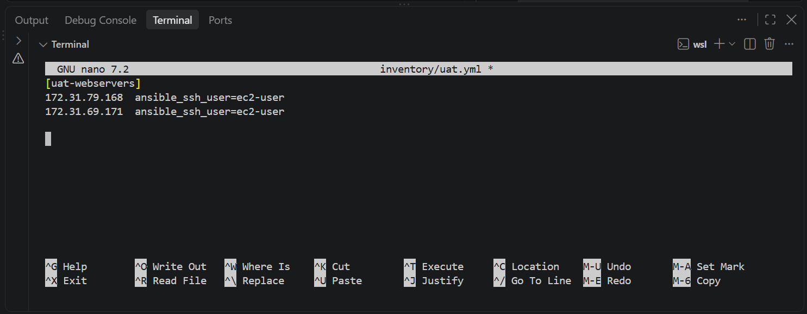

4. Update ansible.cfg to point at your roles directory.

```bash
sudo nano /etc/ansible/ansible.cfg
```
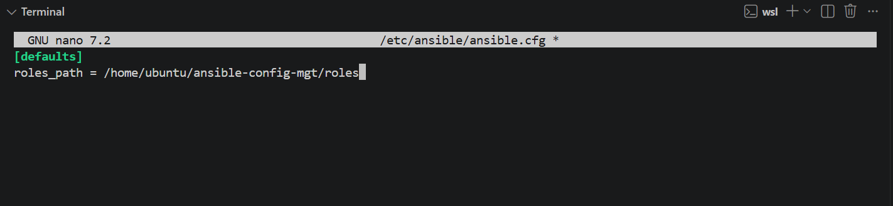
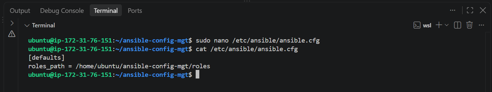

5. It is time to start adding some logic to the webserver role. Go into tasks directory, and within the main.yml file, start writing configuration tasks to do the following:

- Install and configure Apache ( httpd service)   
- Clone Tooling website from GitHub    
- Ensure the tooling website code is deployed to /var/www/html on each of 2 UAT Web servers.   
- Make sure httpd service is started

```bash
---
- name: install apache
  become: true
  ansible.builtin.yum:
    name: "httpd"
    state: present

- name: install git
  become: true
  ansible.builtin.yum:
    name: "git"
    state: present

- name: clone a repo
  become: true
  ansible.builtin.git:
    repo: repo: https://github.com/StegTechHub/tooling.git
dest: /var/www/html
    dest: /var/www/html
    force: yes

- name: copy html content to one level up
  become: true
  command: cp -r /var/www/html/html/ /var/www/

- name: Start service httpd, if not started
  become: true
  ansible.builtin.service:
    name: httpd
    state: started

- name: recursively remove /var/www/html/html/ directory
  become: true
  ansible.builtin.file:
    path: /var/www/html/html
    state: absent
```
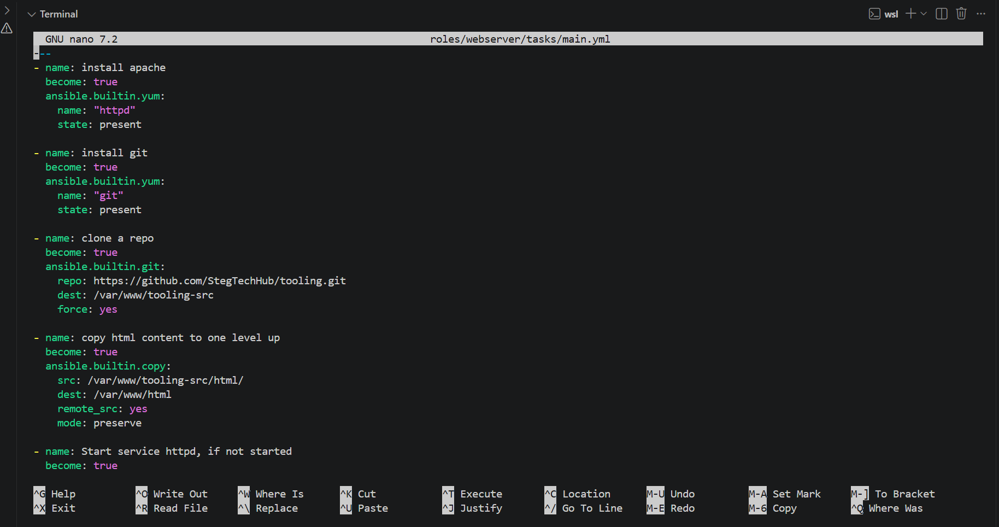

# Step 4 – Reference 'Webserver' role

Within the ```static-assignments``` create a new assignment for ```uat-webservers.yml```. This is where the role will be referenced. 
```bash
cd ~/ansible-config-mgt/static-assignments
nano uat-webservers.yml

---
- hosts: uat-webservers
  roles:
     - webserver
```
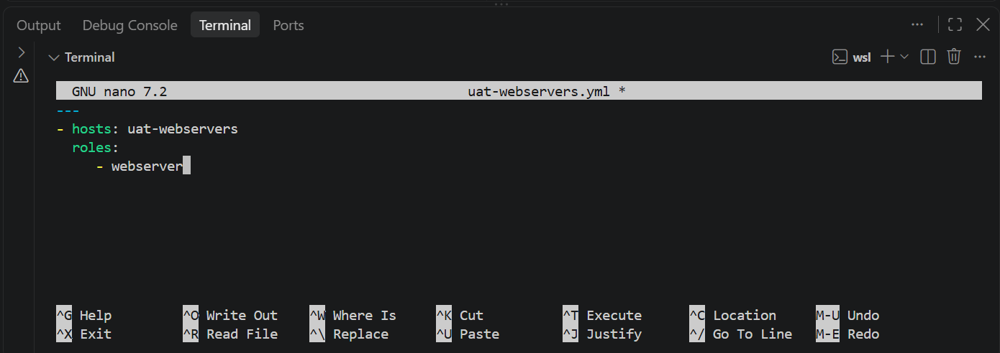

2. playbooks/site.yml — it should now import both assignments:

```bash
nano playbooks/site.yml
```

```bash
---
- hosts: all
- import_playbook: ../static-assignments/common.yml

- hosts: uat-webservers
- import_playbook: ../static-assignments/uat-webservers.yml
```
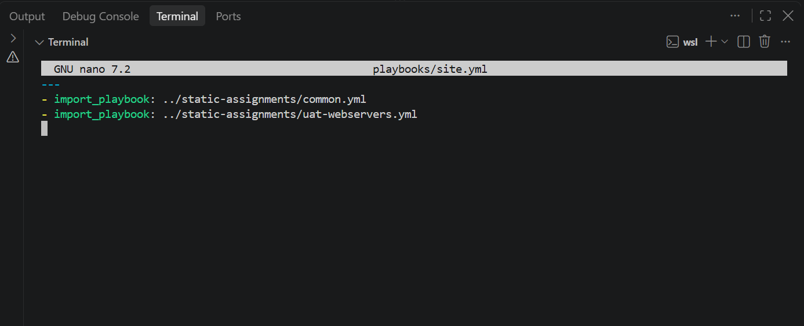

# Step 5 - Commit and Test
After completing the webserver role and refactoring site.yml with static assignments, commit push the changes through the CI/CD pipeline to be tested against the UAT environment.

1. Commit the changes, create a Pull Request and merge them to main branch, make sure webhook triggered two consequent Jenkins jobs, they ran successfully and copied all the files to your Jenkins-Ansible server into /home/ubuntu/ansible-config-mgt/ directory.

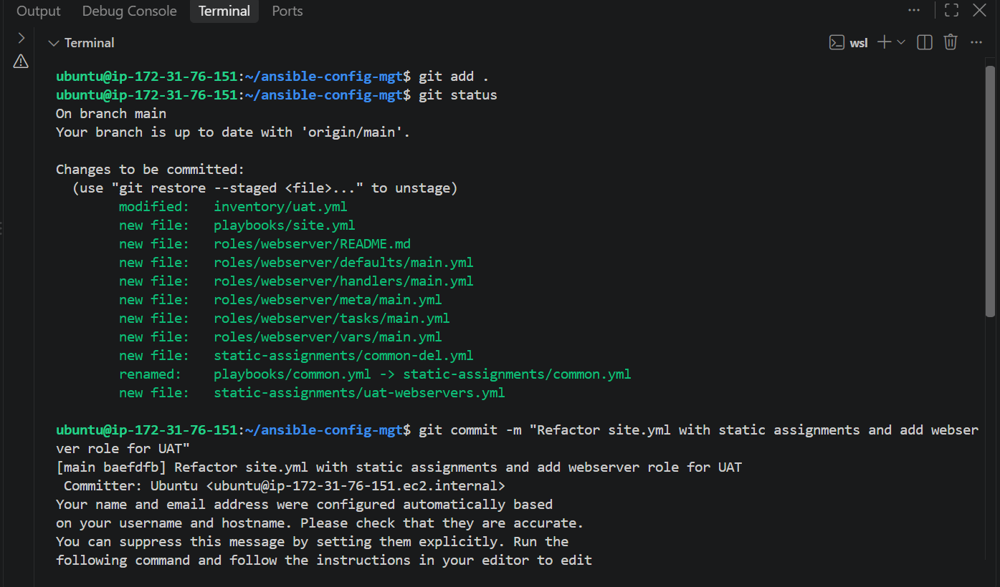
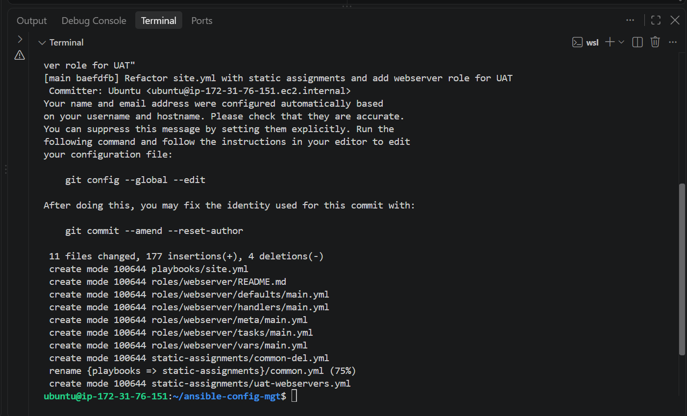
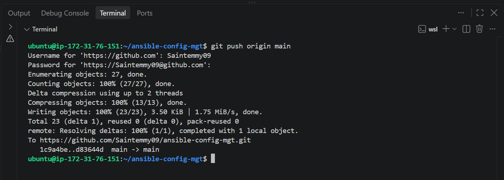

2. The webhook successfully triggered the two jenkins job

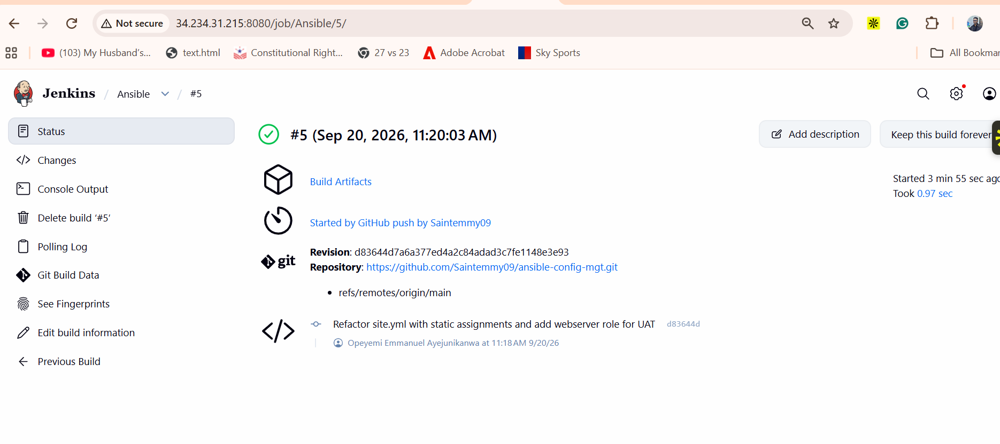
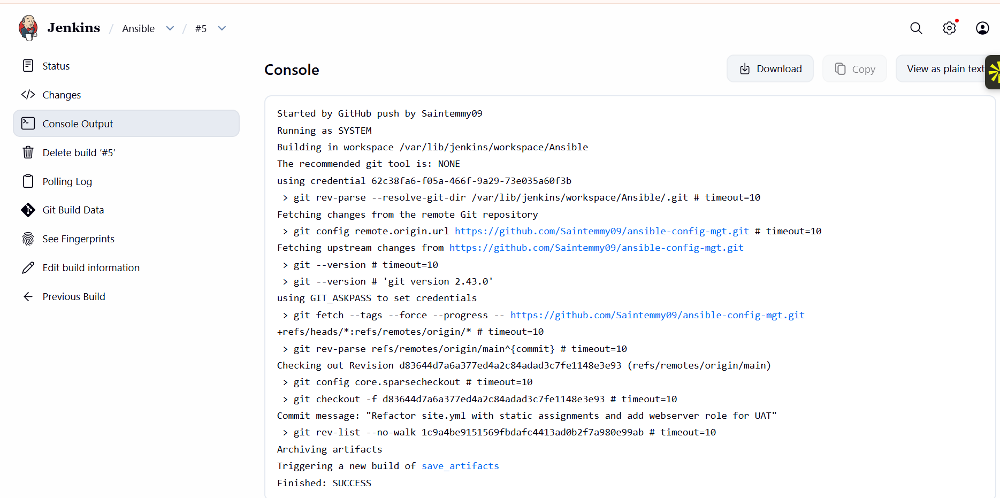

Confirmed via Jenkins Console Output (save_artifacts build #3): "Copied 58 artifacts from 'Ansible' build number 5 — Finished: SUCCESS". This verifies the webhook-triggered pipeline correctly delivered all updated files from GitHub to the Jenkins-Ansible server's /home/ubuntu/ansible-config-mgt/ directory.
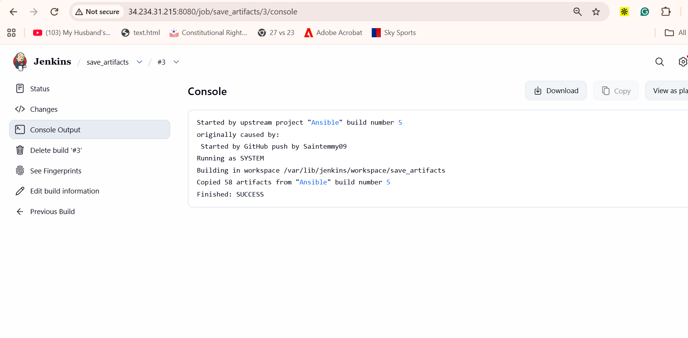

3. Run the playbook against the UAT inventory
```bash
ansible-playbook -i inventory/uat.yml playbooks/site.yml
```
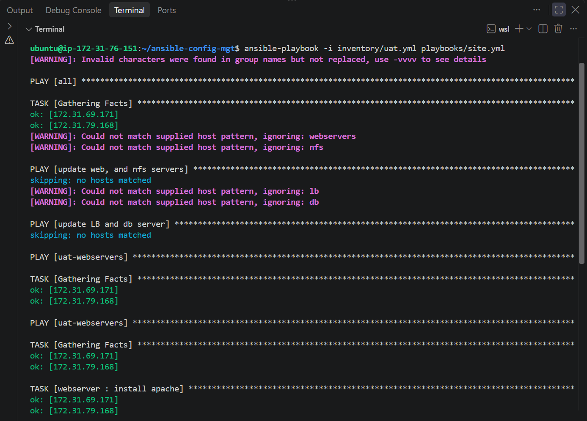
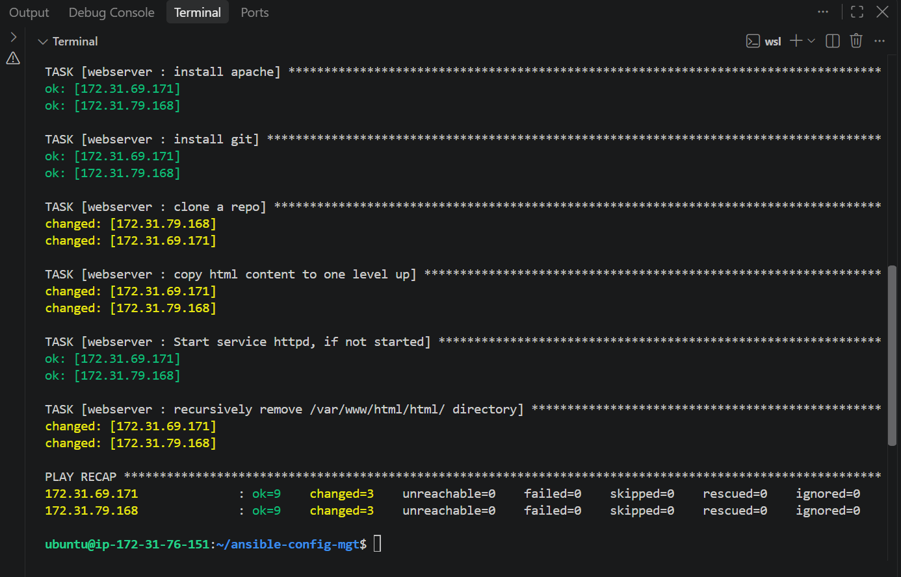

4. Verify both UAT Web servers (Web1-UAT and Web2-UAT) are correctly configured with the webserver role and successfully serve the StegTechHub Tooling website when accessed via browser. 

```bash
http://44.200.103.57/index.php
http://35.171.47.181/index.php
```
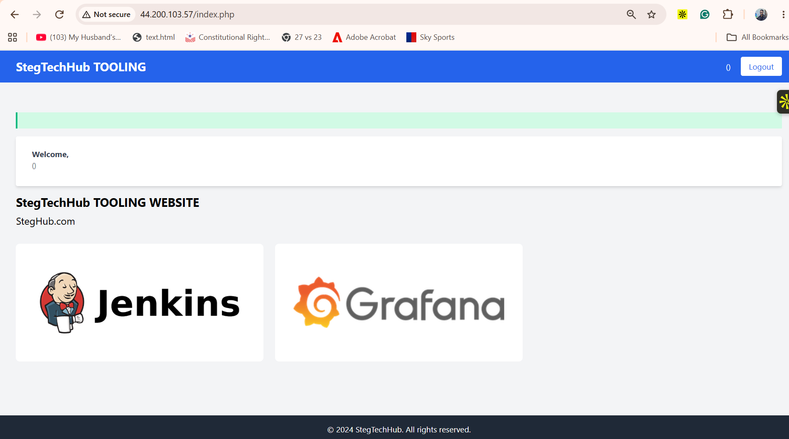
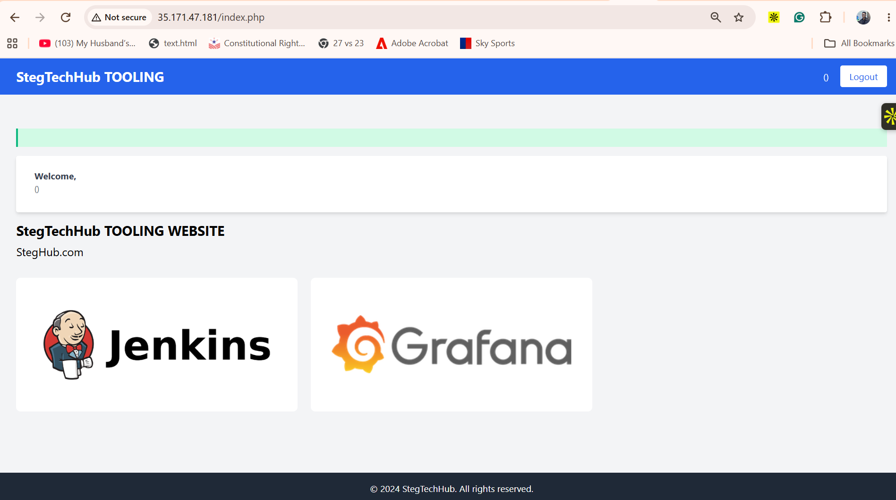

# Conclusion: Conclusion

In this project, the Project 11 Ansible codebase was refactored using imports and roles, restructuring it into a modular site.yml entry-point playbook that imports smaller, reusable playbooks from a static-assignments directory. A dedicated webserver role was built to configure two new UAT web servers, and connected via a static assignment imported into site.yml.

After changes were committed and pushed, the Jenkins webhook was confirmed to have correctly delivered the code to the Jenkins-Ansible server. Running the playbook against the UAT inventory initially failed due to the role pointing to the wrong source repository; this was traced and fixed by updating it to the correct StegTechHub Tooling repo. After the fix, the playbook ran cleanly, and both UAT web servers were verified live and serving the Tooling website in the browser.

This project strengthened understanding of Ansible's modular structure for scaling configuration across environments, and provided practical experience debugging a real deployment issue.